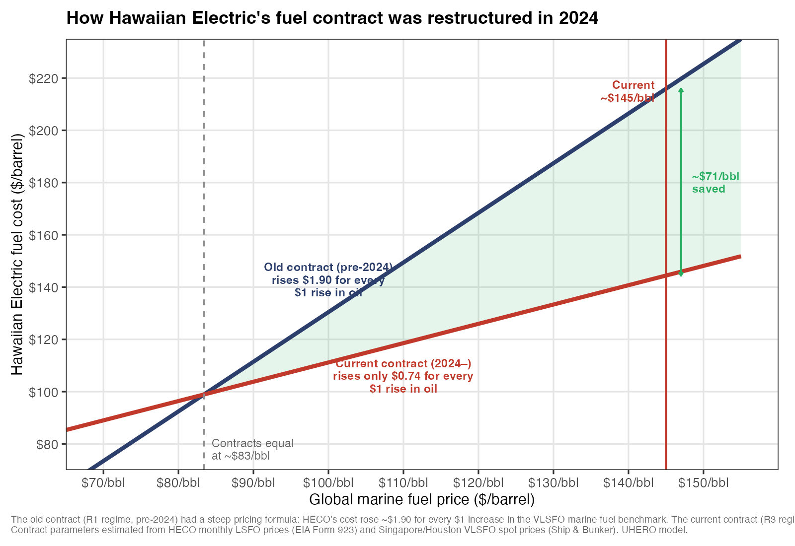
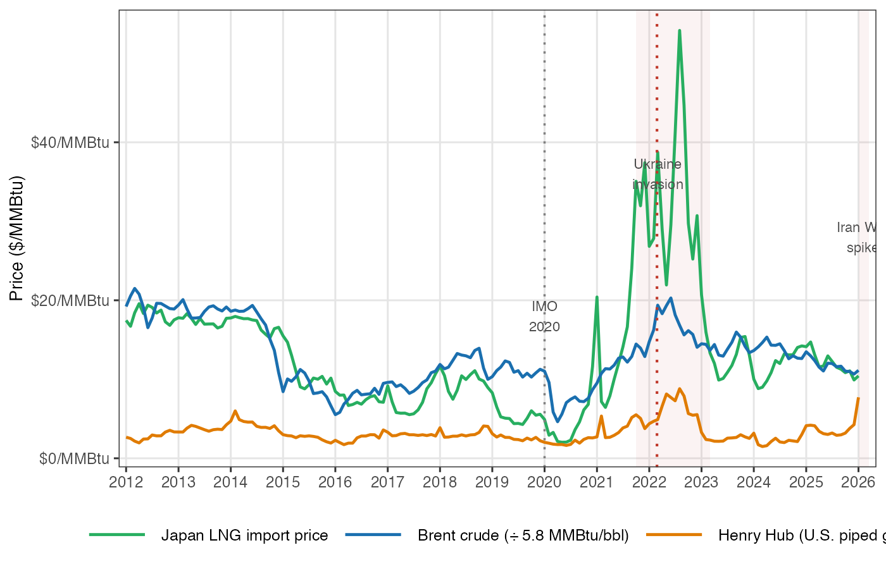
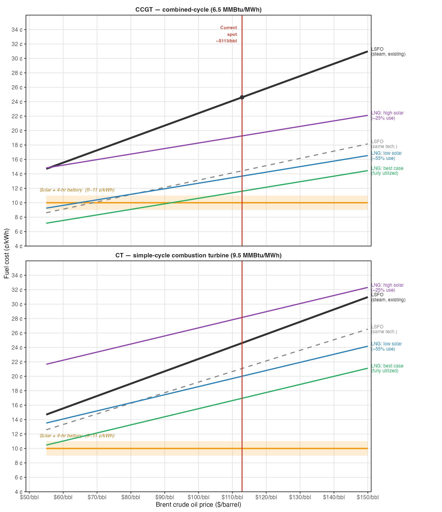

---
output:
  pdf_document: 
    latex_engine: xelatex
mainfont: "Arial"
---
 Hawaii's Fuel Bill: What the Numbers Really Show

**Michael J. Roberts | UHERO | April 2026**

Hawaiʻi's electricity rates are the highest in the nation — roughly three times the U.S. average. The main reason is simple: the islands burn imported oil, and shipping petroleum to the middle of the Pacific is expensive. Two developments deserve close attention from anyone trying to understand where rates are headed.

---

## A quiet win hiding in plain sight

In 2024, Hawaiian Electric renegotiated its fuel supply contract with Par Pacific, the Kapolei refinery that provides most of Oʻahu's power plant fuel. The change was significant. The old contract, signed during an inflation spike and Russia's invasion of Ukraine, was extraordinarily steep: every $1 rise in global oil prices translated into roughly $1.90 in higher fuel costs for customers. The poor terms reflected real stress on Par Pacific at the time: the refinery was still recovering from COVID-era revenue losses, and a prolonged global spike in low-sulfur fuel oil prices — set off by the shipping industry's 2020 agreement to cut sulfur emissions by roughly 70% — had pushed its margins to the limit. The new contract is far flatter — about $0.74 for each dollar increase in oil. It also gives Par Pacific a better floor when prices are low, making it a more balanced arrangement for both parties.

*How much the pricing formula matters becomes clear at current oil prices. If global marine fuel prices, currently near $145 per barrel, remain elevated, the new contract will save Hawaiian Electric customers roughly $70–75 per barrel — or about $45–55 million every month — compared to what the old contract would have cost. Bills are still rising as fuel storage tanks replenish with higher-priced oil; but under the old contract, the increase would have been roughly twice as large.*

---

## The LNG mirage — and the real comparison

A proposal from JERA Co., Japan's largest power producer, would replace Hawaiian Electric's oil-fired generation with liquefied natural gas: a new gas-fired power plant fed by an offshore import terminal. The economic case rests on the claim that natural gas is dramatically cheaper than oil.

On the U.S. mainland, that's true. Henry Hub natural gas trades at $3–4 per million BTU — roughly one-fifth the energy cost of fuel oil. But Hawaiʻi has no pipeline. Gas must be supercooled to liquid form, loaded onto specialized tankers, and converted back to gas on arrival. Those steps — liquefaction, transoceanic shipping, regasification — add roughly $6–8 in costs for every $10 of commodity value. The honest delivered price is around $17–18 per million BTU, not $3.

More importantly, the Pacific LNG market is volatile in ways that Henry Hub is not. During the 2022 European energy crisis, Pacific LNG spot prices rose above $30 per million BTU — while Henry Hub barely moved. The same dynamics are visible today.

*The green line — Pacific LNG import prices — has repeatedly spiked far above Brent crude oil (blue). Long-term contracts tied to Henry Hub provide some insulation, but when global supply is tight, sellers have both the incentive and the contractual tools (force majeure, price review clauses) to renegotiate. As a small buyer representing a fraction of a percent of global LNG trade, Hawaiʻi would have little leverage in any such renegotiation.*

---

## The real fuel-cost picture

Even at the honest delivered price, LNG is cheaper than Hawaiian Electric's oil — by roughly $4–6 per million BTU at current prices. But the headline comparison in most LNG analyses bundles two things together: a fuel switch and a generator upgrade. Hawaiʻi's existing power plants are old steam turbines that burn about 11 units of fuel per megawatt-hour of electricity. A modern gas turbine burns only 6.5 — 40% less. Most of what looks like a "fuel saving" from switching to LNG is actually the benefit of building a newer, more efficient generator — which would reduce costs whether the plant burned gas or oil.

The figure below separates these effects. Each panel fixes the generator technology; within each panel, the gap between the two LSFO lines shows what efficiency improvement alone would save, and the remaining gap between the grey dashed line and the LNG lines shows the fuel-price advantage of gas over oil.

*At current oil prices, LNG has a real fuel-cost advantage — but it is modest and depends heavily on terminal utilization. Under Hawaiian Electric's own preferred renewable buildout scenario (high solar, purple line), the FSRU runs at only about 25% of capacity, pushing regasification costs so high that LNG burned in a simple-cycle turbine (bottom panel) costs more than oil in the same turbine. Meanwhile, solar with battery storage — the amber band — is cost-competitive with either fossil option at any generator efficiency, with no fuel price risk and no long-term take-or-pay commitment.*

---

## What this means

The 2024 contract renegotiation was a genuine, significant win for Hawaiian Electric customers. The savings are real and growing as oil prices rise. Any LNG investment deserves the same level of scrutiny applied to that renegotiation: the pricing structure matters at least as much as the headline number.

The investment case for LNG is positive in the scenarios where cheaper and less volatile renewable energy grows slowly — but those are precisely the scenarios that conflict with Hawaiʻi's own energy policy goals. In the scenarios where policy succeeds, the LNG terminal sits largely idle while ratepayers still pay for it. The upside is modest and front-loaded; the downside arrives when things go wrong — and in energy markets, they eventually do.

---

*This post summarizes [UHERO Brief: Hawaii's Fuel Cost Problem — What the LSFO–LNG Price Comparison Really Shows](https://uhero.hawaii.edu). Data and replication code are available at [github.com/mikejrob/hawaii-lng-lsfo-brief](https://github.com/mikejrob/hawaii-lng-lsfo-brief).*
