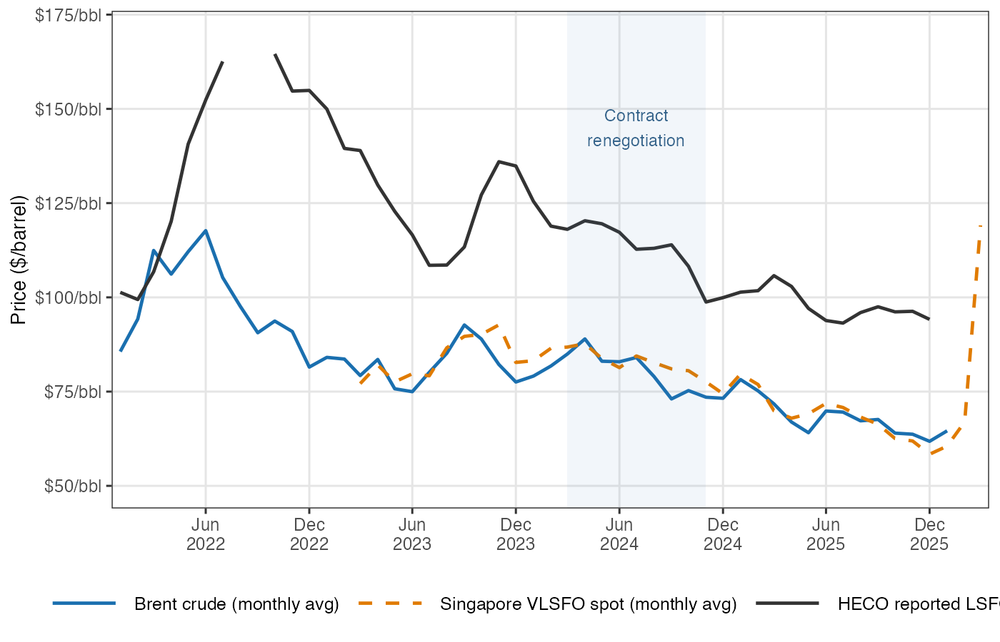
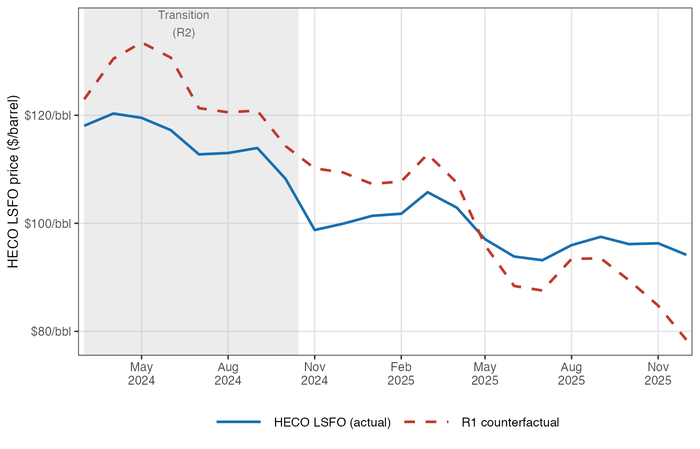
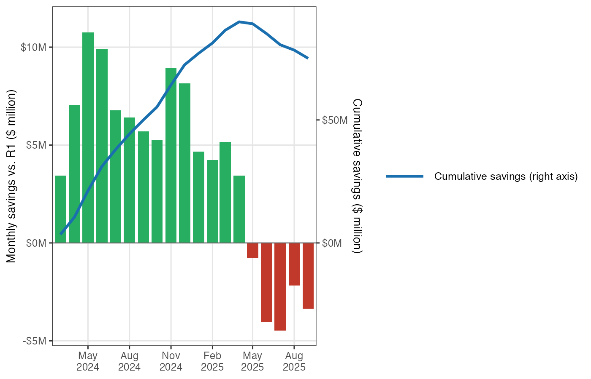
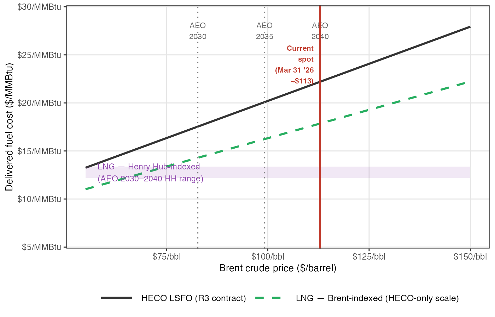
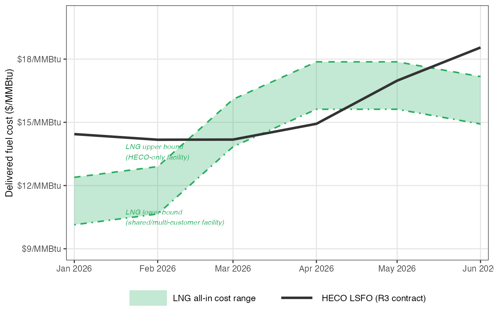

---
output:
  pdf_document:
    latex_engine: xelatex
mainfont: "Arial"
---

# Hawaii's Fuel Cost Problem: What the LSFO–LNG Price Comparison Really Shows

### Michael J. Roberts

**UHERO Brief \| University of Hawaiʻi Economic Research Organization** *April 2026*

------------------------------------------------------------------------

### Key Findings

-   **A 2024 renegotiation of Hawaiian Electric's fuel supply contract has already saved customers tens of millions of dollars — and is now shielding them from much of the current oil price spike.** The previous contract was structured so that every \$1 rise in the global price of oil translated into roughly \$1.90 of higher fuel costs — amplifying every swing in the oil market rather than dampening it. The renegotiated contract has a much flatter pass-through. It has saved an estimated **\$70–75 million** since mid-2024. At current elevated oil prices, the new structure is protecting customers from roughly **\$45–55 million per month** in extra costs — about **8–10 cents on every kilowatt-hour** — compared to what the old contract would have charged. Bills will still rise roughly **8 cents per kilowatt-hour** as fuel storage tanks refill with costlier oil; under the old contract, that increase would have been closer to **18–20 cents**.

-   **Natural gas is cheaper per unit of energy than oil — but getting it to Hawaiʻi is expensive, and the advantage is narrower than it first appears.** Mainland U.S. natural gas costs only about \$3–4 per unit of energy (roughly one-fifth the price of fuel oil), but Hawaiʻi has no gas pipeline. Gas must be supercooled to liquid form at an export terminal, shipped across the Pacific on specialized tankers, and converted back to gas on arrival — steps that together add roughly **\$6–8 in delivery costs for every \$10 of commodity value**. At current oil prices, liquefied natural gas (LNG) delivered to a Hawaiʻi terminal costs roughly **\$18 per million BTU** — compared with **\$22–23** for Hawaiian Electric's fuel oil. (A million BTU, the standard unit for comparing fuel energy across sources, is roughly the heat in eight gallons of gasoline.) That is a real but modest advantage — and part of what once made fuel oil look unusually expensive was the unfavorable structure of Hawaiian Electric's old supply contract, not a fundamental gap between gas and oil costs. The 2024 renegotiation has narrowed the cost gap further.

-   **The resulting fuel savings are modest and shrink as renewable energy grows.** After covering the cost of financing a **\$500 million** import terminal, net fuel savings amount to roughly **2 cents per kilowatt-hour** under slow renewable deployment — or **less than half a cent** if Hawaiian Electric's own preferred renewable buildout proceeds on schedule (see Table 1). Savings decline steeply as solar and wind take over more of the power supply. Terminal costs are uncertain: large infrastructure projects in remote island settings commonly exceed initial estimates by 40–70%. The investment case also involves a new power plant, adding an estimated **\$1.0–1.5 billion** in capital costs.

-   **Solar with battery storage is already cost-competitive with fossil fuel generation — on fuel costs alone.** At current elevated oil prices, Hawaiian Electric's fuel cost runs roughly **25 cents per kilowatt-hour** in its aging oil-fired plants. LNG burned in a new high-efficiency gas turbine comes to about **12 cents** — but this comparison bundles a fuel switch with a generator efficiency upgrade that would reduce costs whether the new plant burned gas or oil. The fuel price difference alone, comparing both fuels in the same type of power plant, is roughly **4–5 cents per kilowatt-hour**. Solar with battery storage in Hawaiʻi is estimated to cost **9–11 cents per kilowatt-hour** all-in — competitive with either fossil option at current prices — with no fuel price risk.

-   **Long-term LNG supply contracts carry significant risks that could offset the savings.** Standard agreements require buyers to pay for **85–95% of contracted supply volumes** even when the fuel is not burned — so faster-than-expected growth in solar and wind becomes a financial penalty rather than a benefit. Pacific LNG spot prices have spiked to **\$30–40 per million BTU** during supply crises, and sellers typically seek to renegotiate contracts precisely when buyers most need the price protection. As a tiny fraction of global LNG trade, Hawaiʻi would have little bargaining power in any such negotiation. The potential gain — at most **2 cents per kilowatt-hour** in favorable scenarios — is modest and heavily front-loaded; the downside risks are larger and tend to arrive under the worst circumstances.

------------------------------------------------------------------------

## 1. Introduction

Hawaiʻi's electricity rates are the highest in the nation — roughly three times the U.S. average — and have been for decades. The main reason is straightforward: the state's electric utilities burn imported oil to generate most of their power, and it costs a great deal to ship petroleum to remote islands in the middle of the Pacific.

Hawaiian Electric Company (HECO) generates most of Oʻahu's electricity by burning low-sulfur fuel oil (LSFO) at its Kahe and Waiau power plants on Oʻahu, purchased from Par Pacific's Kapolei refinery under a long-term supply contract. A proposal from JERA Co., Japan's largest power producer, would replace this arrangement with liquefied natural gas (LNG): a new gas-fired power plant fed by an offshore floating import terminal. The total investment is estimated at approximately \$1.5–2 billion. JERA has cited roughly **\$0.5 billion** for the dedicated import terminal (a floating storage and regasification unit, or FSRU, plus a marine berth and pipeline connections to shore), with an estimated **\$1.0–1.5 billion** for new gas-fired generating capacity, and commercial operation targeted for 2030.

The central economic argument for LNG is that it is cheaper to burn than fuel oil. That argument has merit, but it requires two qualifications that this brief examines in detail. First, LNG's delivered cost to Hawaiʻi — including liquefaction, transoceanic shipping, and conversion back to gas on arrival — is far higher than the mainland U.S. gas prices often cited; the honest comparison is all-in LNG against what Hawaiian Electric actually pays for oil. Second, and less widely recognized: part of what made Hawaiian Electric's fuel oil look so expensive in recent years was not the global oil market but the terms of its own supply contract. Those terms were unusually unfavorable — the contract's steep pricing structure amplified crude oil price swings rather than dampening them. A 2024 renegotiation substantially improved those terms, narrowing the cost gap with LNG and delivering tens of millions of dollars in savings before a single drop of LNG was imported. Understanding both of these qualifications is essential to evaluating the LNG proposal on its actual merits.

This analysis is limited to fuel pricing. It emerged from work to refine energy cost inputs for a comprehensive grid optimization study using the Switch model — and the details of HECO's fuel supply contract, particularly the 2024 renegotiation, proved consequential enough to warrant a standalone treatment. Whether LNG is the right investment when weighed against the full portfolio of alternatives — accelerated solar and wind development, energy storage, demand response, and grid flexibility — requires that broader analysis, which we are pursuing separately.

------------------------------------------------------------------------

## 2. How Hawaiian Electric's Fuel Bill Works

Hawaiian Electric purchases LSFO under a contract with Par Pacific that ties the price to a globally traded marine fuel called very low-sulfur fuel oil (VLSFO) — a standardized low-emissions fuel grade used by oceangoing ships that trades actively at hubs like Singapore and Houston. VLSFO itself is tightly linked to global crude oil prices, so the mechanical chain runs: *global crude markets → VLSFO spot price → Hawaiian Electric contract price*.

The contract does not simply pass through the daily VLSFO price. The contract sets HECO's purchase price based on a rolling average of recent VLSFO prices — so a sudden market spike works its way into HECO's fuel cost only gradually, across many deliveries. On top of that, HECO stores fuel in large tanks and draws on that inventory over time, so what customers pay in any given month reflects the blended cost of fuel purchased over many preceding weeks — not just the most recent delivery. These two layers of smoothing together explain why a rapid price surge like that of early 2026 appears in customer bills only gradually, as older, cheaper inventory is depleted and replaced at higher prices. This buffering works in both directions: it also delays the benefit when prices fall. The transition between contract regimes adds a further wrinkle: HECO appears to have drawn down much of its inventory before the renegotiation, allowing it to rebuild under the new terms — which is why the full effect of the renegotiated contract took several months to show up in reported prices.

The contract's pricing formula has two key parameters: the *slope* (how much HECO's price rises for each dollar increase in VLSFO) and the *intercept* (a base level that provides a floor for Par Pacific's revenue). These parameters have changed substantially over the contract's history.

*Figure 1. Monthly Brent crude, Singapore VLSFO spot price, and HECO reported LSFO purchase price, 2022–2026. All series in \$/barrel. The shaded band marks the contract renegotiation window (March–November 2024). Sources: FRED, Ship & Bunker, EIA Form 923.*

------------------------------------------------------------------------

## 3. The Par Contract: A Complex History

### COVID, IMO 2020, and an Unusual Starting Point

In January 2020, new International Maritime Organization (IMO) regulations took effect requiring oceangoing ships to switch from high-sulfur fuel oil to low-sulfur alternatives. This abruptly elevated VLSFO prices relative to crude oil, as refineries scrambled to produce more low-sulfur product. Then, two months later, the COVID-19 pandemic collapsed demand for aviation fuel, gasoline, and marine fuel simultaneously. Par Pacific, HECO's refinery supplier, faced severe financial stress as demand for nearly all of its products evaporated at once.

The fuel supply contract renegotiated in this environment — which we refer to as the R1 regime (for the first contract structure) — gave Par Pacific a generous margin structure: a steep slope (approximately 1.9 dollars of LSFO price increase for each dollar increase in the VLSFO benchmark) and a large negative intercept. In plain terms, Par received roughly \$1.90 in additional LSFO revenue for every dollar that the VLSFO benchmark rose. The commercial logic was sound: Par needed assurance that the refinery would remain economically viable. But it meant that HECO customers were bearing substantial price risk on the upside.

From 2022 through early 2024, as global energy prices surged following the Russian invasion of Ukraine and global supply chains tightened, this contract structure amplified the pass-through to HECO customers. LSFO prices reflected not just the commodity cost of crude oil but also Par's elevated margin entitlement.

*Figure 2. HECO reported LSFO price (blue) vs. estimated R1 counterfactual price (red dashed), March 2024–December 2025. The vertical gap between the lines is the monthly saving (or cost) from the renegotiation. The grey band marks the R2 transition period. Sources: EIA Form 923, Hawaiian Electric filings, UHERO model.*

### The 2024 Renegotiation

The contract was revised in 2024 — what we term the R3 regime (the current contract). While exact terms are confidential, their effect is clearly visible in public LSFO price data. The new structure has a substantially flatter slope (\~0.74, compared to \~1.90 under R1) and a positive intercept (\~\$37/barrel). In practice, this gives Par Pacific a better price floor when crude is low — providing some protection against prolonged price slumps — while capping the LSFO price premium that HECO customers pay when crude is high. It is a more symmetric risk-sharing arrangement than R1.

To quantify the difference, we estimate what HECO's LSFO costs would have been under R1 terms during the post-renegotiation period and compare it to actual R3 costs. The cumulative difference through the end of 2025 amounts to approximately **\$70–75 million in savings** for HECO customers (measured against R1 terms negotiated under acute COVID-era financial stress at Par Pacific; whether those terms would have persisted in a normalized market is uncertain).

More dramatically, the current VLSFO price spike — driven by refining disruptions associated with the Iran War — illustrates precisely the kind of exposure the R3 renegotiation was designed to limit. The R3 and R1 formulas cross at a VLSFO price of roughly **\$83/barrel**: below that level, R1 would actually be cheaper; above it, R3's savings grow proportionally with the market price. At \$145–150/barrel VLSFO (the mid-March 2026 level), the implied monthly fuel cost difference between R3 and R1 amounts to roughly **\$45–55 million per month** — approximately **8–10 cents per kWh** across total electricity sales. Because customer bills reflect the average cost of fuel in HECO's storage tanks — not the price of the most recent delivery — this has not yet passed through to bills; the tanks still contain fuel purchased before the spike. If VLSFO remains elevated, customers will see roughly **8 cents/kWh** added to their bills relative to January 2026 — about a 20% increase in a typical bill — as the averaging window catches up. Under R1 terms, the equivalent fuel cost increase would have been roughly **18–20 cents/kWh**, or about 45–50% of a typical bill. These figures are based on Brent-implied VLSFO projections; if the current VLSFO-Brent spread persists, actual costs and savings will be larger still.

*Figure 3. Monthly fuel cost savings (green) or additional costs (red) under the R3 contract relative to the R1 counterfactual, and cumulative total (blue line, right axis). Negative months reflect periods when crude prices were low enough that R1's steeper slope would have produced lower LSFO prices. Sources: EIA Form 923, Hawaiian Electric filings, UHERO model.*

This history has a direct implication for any LNG contract negotiation: the structure of the pricing formula — its slope, its floor, its averaging window — has been worth tens of millions of dollars annually to HECO customers, with the benefit growing sharply as VLSFO rises above the \~\$83/barrel level where the R3 and R1 formulas cross. Getting the contract structure right matters at least as much as the headline price comparison.

------------------------------------------------------------------------

## 4. The LNG Price Comparison: What the Numbers Show

### The Basic Formula

Hawaiʻi cannot access natural gas through a pipeline. LNG must be liquefied at an export terminal, loaded onto specialized tankers, shipped to an import facility, and regasified before it can be burned. Each step adds cost. The Hawaii State Energy Office (HSEO) commissioned a feasibility study from Facts Global Energy (FGE) in August 2024, which identified **0.4 million metric tons per year (mtpa)** as roughly the minimum throughput at which a floating storage and regasification unit (FSRU) — an anchored ship that receives LNG tanker deliveries, stores the fuel, and converts it back to gas — could be economically viable at Hawaiʻi scale. At that throughput, regasification adds approximately **\$3.93 per million BTU (MMBtu)** on top of the commodity cost — a significant adder. (The MMBtu is the standard unit for comparing energy content across fuels; one MMBtu is roughly the heat in eight gallons of gasoline.) These FSRU costs are largely fixed regardless of how much gas actually flows through, so the effective cost per MMBtu rises sharply at low utilization: at the roughly 25% average use implied by Hawaiian Electric's preferred renewable buildout scenario, the regasification adder would approach **\$16 per MMBtu** — nearly quadruple the full-capacity figure. To put 0.4 mtpa in perspective: burned in a new combined-cycle gas turbine (6.5 MMBtu per megawatt-hour of electricity, a measure of its fuel efficiency), it could supply roughly **3,200 gigawatt-hours (GWh) per year** — more than half of Hawaiian Electric's current annual electricity sales of approximately 6,100 GWh. Burned in a simpler, less efficient combustion turbine (about 9.5 MMBtu/MWh), the same volume would yield roughly **2,200 GWh per year**, or about a third of net sales. Whether 0.4 mtpa matches actual dispatch requirements depends on the generation mix, the pace of renewable buildout, and the role of other thermal resources — questions addressed in Section 6.

HSEO's August 2024 feasibility work cited an indicative contract price for LNG delivered to Hawaiʻi of approximately **0.118 times the Brent crude price plus \$0.60 per MMBtu**, with regasification added separately. As of March 31, 2026, Brent futures were trading at approximately **\$113 per barrel** (front-month contract), translating to an all-in delivered cost of approximately **\$17.9/MMBtu** for a 0.4 mtpa facility.

HECO's steady-state LSFO cost at the same Brent price, once its inventory averaging window fully rebuilds under the current R3 contract structure, is approximately **\$22.2/MMBtu**. The fuel cost difference favoring LNG is thus approximately **\$4.3/MMBtu** at current prices.

JERA has also indicated that it may structure the contract with pricing indexed to Henry Hub, the U.S. natural gas benchmark, rather than to Brent crude. Under a standard Henry Hub-linked LNG structure — roughly 115% of Henry Hub plus liquefaction, shipping, and regasification costs totaling around \$8/MMBtu — the all-in delivered price at current Henry Hub prices (\~\$3.50/MMBtu) would be approximately **\$12/MMBtu**, a wider advantage against LSFO. Henry Hub is not, however, a stable benchmark: it exceeded **\$7/MMBtu in January 2026**, which would raise the all-in Hawaiʻi cost to roughly **\$16.50/MMBtu** — comparable to LSFO at moderate oil prices. The formula price advantage depends on where the index sits, not just its average level.

### The Long-Run Picture

The economic advantage of LNG over LSFO depends heavily on oil prices. At low crude prices, LSFO becomes relatively cheap, and the case for LNG narrows. Our long-run model, which traces HECO's steady-state LSFO cost as a function of the Brent price under the current R3 contract, shows that LNG **fuel** (Brent-indexed, Hawaiian Electric-only facility scale) is cheaper than LSFO at any Brent price above roughly **\$70–75 per barrel** — a threshold comfortably below even the U.S. Energy Information Administration (EIA)'s downside price scenarios for the 2030s.

*Figure 4. Long-run steady-state HECO LSFO cost (R3 contract, black) vs. LNG all-in delivered cost — Brent-indexed (green dashed) and Henry Hub-indexed range (purple band, spanning AEO 2030–2040 Henry Hub). The red vertical marks current Brent (\~\$113/barrel, March 31, 2026), at which LNG saves approximately \$4/MMBtu relative to steady-state LSFO. Grey dotted verticals show the EIA AEO 2026 reference path for 2030 (\$83), 2035 (\$99), and 2040 (\$113). Note that Brent futures as of March 31 imply the 2030 price (\~\$72/bbl) will be well below the AEO reference. All costs in \$/MMBtu. Sources: UHERO model, HSEO/FGE August 2024 indicative formula, EIA AEO 2026, Investing.com.*

### The Forward Path

In the near term, HECO's LSFO costs are rising as its inventory rebuilds under the R3 contract structure. The R3 contract uses a longer lookback window on VLSFO prices than R1 did; as HECO replenishes its inventory to the new, larger target level, the averaging window lengthens and the reported purchase price rises — even if the underlying VLSFO price stays flat. Figure 5 shows actual observed costs for January and February 2026, the model's transition path for March, and a forward projection for April–June based on Brent futures prices as of March 31. On this basis, HECO's LSFO cost rises from approximately \$89/barrel in January to around \$115/barrel by June, with the inventory rebuild accounting for much of the increase above what Brent prices alone would imply.

This projection should be read as a central estimate with material uncertainty in both directions. The underlying Brent-to-VLSFO relationship, estimated statistically, has a root mean squared error of roughly \$4/barrel at daily frequency; more importantly, its residuals are strongly autocorrelated — when VLSFO departs from its Brent-implied level, the gap tends to persist for weeks or months rather than reverting quickly. As of mid-March 2026, VLSFO was running roughly **\$25–35/barrel above** what Brent prices alone would predict, likely driven by the same supply disruption that has pushed crude higher. If VLSFO remains elevated relative to Brent, HECO's actual costs will exceed the projected path shown in Figure 5 — potentially reaching \$140–146/barrel at full averaging-window equilibrium, equivalent to roughly \$22–23/MMBtu. That scenario would widen the fuel cost advantage of LNG relative to LSFO. It would also substantially amplify the savings from the R3 contract renegotiation: the R3 contract's flatter slope (\~0.74 versus R1's \~1.90) means its cost advantage over R1 grows proportionally with VLSFO, reaching roughly **\$70–75/barrel** at current market prices — far larger than the historical average over 2024–2025 that underlies the cumulative savings figures cited above.

*Figure 5. Projected HECO LSFO cost (R3 contract, solid line) vs. the LNG all-in delivered cost range, January–June 2026. Actual observed costs for January and February; model projection for March onward. The shaded band spans the upper bound (HECO-only facility) to the lower bound (shared or multi-customer facility); dashed lines mark each boundary. LNG prices reflect month-specific Brent: realized averages for January (\$67/bbl) and February (\$71/bbl), realized for March (\$98/bbl), and Investing.com futures for April–June (\$113, \$113, \$107/bbl). The LSFO projection assumes VLSFO tracks Brent according to the model relationship; if VLSFO remains elevated above Brent-implied levels (as it was in mid-March 2026), actual LSFO costs would be higher than shown. Sources: UHERO model, HSEO/FGE August 2024 indicative formula, FRED (DCOILBRENTEU), Investing.com.*

------------------------------------------------------------------------

## 5. Henry Hub Is Not a Hawaiʻi Price

Public discussion of LNG for Hawaiʻi has sometimes compared LNG contract costs against continental piped gas — Henry Hub (the main U.S. natural gas price benchmark, based in Louisiana) or Canadian spot prices — which have traded at \$2–4/MMBtu for much of the past decade, dramatically cheaper than LSFO by a factor of three or four. But Hawaiʻi has no pipeline connection to the U.S. gas network or any continental source. There is no way to receive piped gas at any price; gas must be liquefied, shipped, and regasified before it can be burned.

Delivering natural gas to Hawaiʻi requires liquefying it (paying a liquefaction fee of roughly \$2.75/MMBtu), loading it onto an LNG tanker (shipping costs of roughly \$1.50/MMBtu on Pacific routes), and regasifying it on arrival. The economically meaningful price for Hawaiʻi is the Japan-Korea Marker (JKM) — the Pacific LNG spot price benchmark — or equivalently the all-in cost of a long-term delivered LNG contract. Over the past decade, JKM has averaged \$8–12/MMBtu, and has spiked far higher.

The reason for extreme spikes is structural. Liquefaction facilities — the plants that convert pipeline gas into LNG for export — are among the most capital-intensive pieces of energy infrastructure in the world, and new capacity typically takes five to ten years to permit and build. Global liquefaction capacity is therefore relatively fixed over any horizon of a few years. When demand surges — from an unusually cold winter, a geopolitical disruption, or an outage at a major export terminal — there is no quick way to add supply. Cargoes are instead diverted to the highest-paying buyer, and spot prices adjust until demand falls back to meet the constrained supply. This is an inherent feature of the LNG market, not an anomaly.

The relevant comparison is between **LNG all-in** and **HECO's LSFO cost**. On that basis, as we showed above, LNG is indeed cheaper at current prices — but the advantage is \$4–6/MMBtu rather than \$14–18/MMBtu. This distinction matters enormously for assessing whether the investment pencils out.

### The Indexation Question

If a Hawaiʻi LNG contract were indexed to Henry Hub rather than Brent, would this insulate customers from LNG price volatility? Partly, but not fully.

First, Henry Hub is not itself stable. It traded between \$1.60 and \$9.00/MMBtu over the past decade, with sharp winter spikes during cold snaps. In **January 2026**, Henry Hub exceeded **\$7/MMBtu**, which would have produced an all-in delivered cost to Hawaiʻi of roughly **\$16.50/MMBtu** — comparable to LSFO costs under moderate oil prices and far above the benchmark figure of \~\$12/MMBtu that circulates in discussions of Henry Hub-indexed LNG contracts. At \$9/MMBtu Henry Hub, the all-in cost reaches approximately **\$18.50/MMBtu**, higher than LSFO in most scenarios. The formula price alone is not predictably cheaper.

Second, and more fundamentally, the formula price is not necessarily the price Hawaiʻi would pay during a supply crisis. The Pacific LNG market shows this clearly.

*Figure 6. Japan LNG import price, Henry Hub spot price, and Brent crude (converted at 5.8 MMBtu/bbl), monthly, 2012–2026, all in \$/MMBtu. During the 2022 European energy crisis, the Japan LNG price exceeded \$30/MMBtu while Henry Hub remained below \$10/MMBtu — a spread of more than \$20/MMBtu. The Japan LNG series is a monthly average of contract and spot deliveries and understates spot JKM spikes; actual Pacific spot prices peaked above \$40/MMBtu in 2022. Sources: FRED (MHHNGSP, PNGASJPUSDM, POILBREUSDM).*

During the 2022 European energy crisis, the Japan LNG import price — a close proxy for Pacific spot LNG — rose above \$30/MMBtu while Henry Hub was at \$6/MMBtu. The spread between the two benchmarks, which is normally \$5–10/MMBtu reflecting the liquefaction and shipping costs, exceeded \$25/MMBtu. This happened precisely because global liquefaction capacity was fixed: Russia had curtailed pipeline gas flows to Europe, European buyers were competing aggressively for any available LNG cargo, and no new liquefaction capacity could be brought online quickly enough to relieve the squeeze. The cargoes that would otherwise have gone to Asia were redirected west, Asia paid more, and spot prices decoupled sharply from formula-price contracts. During the current Middle East supply disruption, similar dynamics are at work. Formula-price buyers are left exposed to force majeure claims — contractual provisions that excuse a seller from delivery obligations due to extraordinary events — or outright commercial pressure for renegotiation.

### Renegotiation Is the Norm

Long-term LNG contracts have formal pricing mechanisms, but they are regularly revised. An analysis of Japanese, South Korean, Taiwanese, and Spanish LNG import price series finds that contract renegotiations appear as statistically identifiable structural breaks in the pricing relationship — they are not rare exceptions but a recurring feature of LNG markets (Agerton, *Energy Journal*, 2017). These renegotiations tend to occur when there is a large gap between the formula price and the prevailing spot price — precisely the conditions under which the contract's price protection would be most valuable.

The 2020 COVID episode illustrates the process: several Chinese LNG buyers issued force majeure notices, arguing that plant shutdowns prevented them from taking contracted volumes. Sellers pushed back, but the episode opened commercial conversations about contract revisions (Oxford Institute for Energy Studies, 2020). During the 2022 energy crisis, LNG exporters in tight markets faced different pressure: buyers seeking relief from formula prices that had risen along with oil, even as spot cargoes became unavailable at any price.

For Hawaiʻi, these dynamics create asymmetric exposure. As a small buyer — representing a fraction of a percent of global LNG trade — the state has essentially no leverage in any renegotiation. When the market turns against formula buyers, sellers have both the commercial incentive and the contractual tools (force majeure clauses, price review mechanisms) to seek better terms.

------------------------------------------------------------------------

## 6. What Do the Numbers Say Over the Life of the Contract?

A note on current market conditions: as of March 31, 2026, Brent crude front-month futures are at approximately **\$113/barrel** — nearly double the EIA's pre-Iran War Short-Term Energy Outlook reference of \$58/barrel for 2026. At this price, the steady-state LNG advantage is approximately **\$4/MMBtu**. However, markets interpret the spike as temporary. Brent futures fall steeply over the next seven months — from \$113 (May 2026) to \$84 (December 2026) — and settle into a long-run backwardation of around **\$69–73/barrel** from 2029 onward (Investing.com, March 31, 2026). This futures-implied long-run price is roughly 12–14% below the EIA Annual Energy Outlook (AEO) reference path, which projects \$83/bbl in 2030 rising to \$113/bbl by 2040. The futures curve therefore materially changes the economics of the 2029–2044 operating window.

To assess the investment case we use the generation mix projections from HECO's Integrated Grid Plan (IGP), which provides two scenarios spanning the plausible range of renewable deployment. Under the **preferred scenario** — solar, wind, and storage proceed at the pace the IGP considers achievable — total fossil generation falls from about 2,400 GWh in 2029 to under 100 GWh by 2044. Under the **land-constrained scenario** — slower renewable deployment due to siting constraints — fossil generation falls from about 4,000 GWh to around 240 GWh over the same period. As noted above, a 0.4 mtpa facility at CCGT heat rates can supply roughly 3,200 GWh per year. The land-constrained scenario approaches that throughput in its early years but averages only about 55% of it over the full contract period; the preferred scenario averages roughly 25%. Both scenarios imply substantial underutilization — and therefore substantial take-or-pay exposure if contracts are written against 0.4 mtpa capacity. JERA's published economic case appears to assume annual generation on the order of 2.8 TWh/yr (2,800 GWh, or about 2.8 billion kilowatt-hours), which would require throughput well above 0.4 mtpa and exceeds the land-constrained IGP average by more than 55% and the preferred scenario average by more than 3×. How JERA reconciles this with HECO's own renewable deployment plans is not clear from publicly available materials, but the gap between JERA's assumed generation volumes and either IGP scenario is a significant source of divergence between the two economic cases.

The fuel savings in Table 1 reflect two distinct effects: the lower per-MMBtu cost of LNG compared to LSFO, and the higher thermal efficiency of a new combined-cycle gas turbine (**6.5 MMBtu/MWh**) compared to Hawaiʻi's existing oil-fired steam turbines (**\~11 MMBtu/MWh**). These two effects compound, and — as Figure 7 and the discussion below make clear — the efficiency gain is the larger of the two. Note that if HECO would eventually replace its aging steam turbines regardless of fuel choice, the efficiency gain is not attributable to LNG and the net benefit would be smaller.

The correct way to compare fuel savings against capital cost is to convert the capital outlay to an annual repayment stream using HECO's blended cost of debt and equity financing (the weighted average cost of capital, or WACC), subtract that annual obligation from annual fuel savings to get the net annual benefit, and discount the net stream at 5% to obtain a present value. We use **\$0.5 billion** as the capital base — JERA's stated cost for the import terminal — recognizing that this is likely a lower bound and that the power plant represents additional capital whose LNG-attributable share is uncertain. At 7–9% WACC, the terminal's annual financing cost is **\$55–62 million per year**, and the present value of that stream at 5% over 15 years is **\$0.57–0.64 billion**. Table 1 also reports the **breakeven total capex** for each scenario — the maximum total LNG-attributable capital (terminal plus any share of the power plant) at which the investment still breaks even, shown as a range across the two WACC assumptions.

Table 1 presents the results across both scenarios and two oil price paths.

| Scenario | Avg. annual fuel savings | Net after terminal costs (¢/kWh) | Net value today (7% financing cost) | Net value today (9% financing cost) | Maximum capital that breaks even |
|----|----|----|----|----|----|
| Preferred renewable buildout + EIA forecast prices | \$85M/yr | 0.4–0.5¢ | +\$0.62B | +\$0.55B | \$0.93–1.04B |
| Preferred renewable buildout + Market futures prices | \$70M/yr | 0.1–0.2¢ | +\$0.42B | +\$0.35B | \$0.77–0.87B |
| Slower (land-constrained) buildout + EIA forecast prices | \$197M/yr | 2.2–2.3¢ | +\$2.05B | +\$1.98B | \$2.04–2.30B |
| Slower (land-constrained) buildout + Market futures prices | \$157M/yr | 1.6–1.7¢ | +\$1.57B | +\$1.50B | \$1.66–1.88B |

*Table 1. All figures cover the operating period 2029–2044. **Avg. annual fuel savings**: gross annual fuel cost difference (LNG vs. LSFO), averaged over the operating period. **Net after terminal costs (¢/kWh)**: annual fuel savings minus the annual cost of repaying the \$0.5 billion terminal (\$55–62 million/year), divided by Oahu's total annual electricity sales (~6,100 GWh); range reflects 7–9% financing cost. **Net value today**: fuel savings minus capital repayment, expressed in 2026 dollars (discounted at 5% per year). **Maximum capital that breaks even**: the most that could be spent on all LNG-related infrastructure (terminal plus any share of a new power plant) before the investment loses money; range reflects 7–9% financing cost. A new gas-fired power plant would add an estimated \$1.0–1.5B beyond the terminal. **EIA forecast prices**: EIA Annual Energy Outlook 2026 reference path. **Market futures prices**: Brent crude futures as of March 31, 2026, averaging ~\$70/bbl over 2029–2044. Fuel efficiency assumed: 11 MMBtu per megawatt-hour for existing oil-fired steam turbines; 6.5 MMBtu/MWh for a new combined-cycle gas turbine. Because the savings in this table reflect both the lower fuel price of LNG and the higher efficiency of a new generator, approximately 65–75% of the savings shown comes from the efficiency improvement rather than the fuel price difference alone.*

Several observations follow.

**At terminal-only capital, the fuel savings cover the financing requirement across all scenarios.** Annual savings of \$70–85M/yr (preferred) and \$157–197M/yr (land-constrained) both exceed the \$55–62M/yr financing cost of a \$0.5B terminal. Even the weakest case — preferred scenario under futures oil prices — produces a net PV of +\$0.35–0.42B. The breakeven column in Table 1 shows how much total LNG-attributable capital each scenario can sustain before going negative.

**The power plant is the critical unknown.** Whether the \$1.0–1.5B power plant cost is attributable to the LNG decision depends on whether Hawaiian Electric would build new generating capacity anyway as its aging steam turbines retire. If the answer is yes — new gas-fired plant would be needed for reliability regardless of fuel — only the \$0.5B terminal is LNG-specific and the economics look solid. If the power plant is contingent on LNG, the preferred + futures case reaches its breakeven at \$0.77–0.87B total capex, leaving only \$0.27–0.37B of headroom above the terminal cost — less than 25% of the power plant. Beyond the attribution question, the proposed plant may not be optimally sized or timed relative to what would be built in the absence of LNG; a plant dimensioned around 0.4 mtpa throughput may be larger than Hawaiʻi's declining fossil generation needs by the 2030s.

**Cost overruns could consume thin margins in the preferred scenario.** Flyvbjerg's systematic review of megaprojects finds average cost overruns of 40–70% across large infrastructure investments, with the upper tail driven by technically novel or remote projects — both of which apply here (Flyvbjerg, *Oxford Handbook of Megaproject Management*, 2014). IEA and IRENA analyses of island-state LNG terminals and FSRUs specifically note construction cost uncertainty of 30–80% above initial estimates, attributed to marine logistics, permitting complexity, and limited local contractor competition. JERA's \$0.5B figure has not been independently verified or subjected to PUC review. Applying the midpoint of this range: a 60% overrun implies an actual terminal cost near **\$0.8B**, which nearly exhausts the breakeven headroom in the preferred + futures scenario (\$0.77–0.87B). A 70% overrun (\$0.85B terminal) flips that scenario negative without any power plant attribution. The land-constrained scenarios are substantially more resilient — breakeven capex of \$1.66–2.30B — meaning even a 70% overrun on the terminal leaves ample margin unless substantial power plant costs are also assigned to the LNG decision.

**Savings decline sharply after the mid-2030s in both scenarios.** Annual savings fall from roughly \$230M in 2029 to under \$10M by 2044 in the preferred scenario, as fossil generation approaches zero. Even in the land-constrained scenario, savings fall below the terminal's financing cost in the final years of the contract. The front-loaded savings carry the positive PV; the back half of the contract is a drag. This timing mismatch matters for HECO's financial planning and for the terms of any take-or-pay commitment.

**Price-path uncertainty spans roughly \$0.5B in outcomes.** The AEO and futures price paths differ by about \$13–40/bbl over the 2029–2044 operating window — EIA projects prices rising from \$83/bbl to \$113/bbl; futures markets price a flat \$69–73/bbl. The resulting difference in net PV is roughly \$0.4–0.5B in each scenario. Neither forecast is reliable; the futures path reflects current market consensus, which the academic literature finds more accurate on average than agency projections over long horizons.

**The efficiency gain should not be fully attributed to the LNG decision.** Hawaiian Electric's aging steam turbines will need replacement regardless of fuel choice. A new combined-cycle gas turbine uses about 40% less fuel per kilowatt-hour than the existing steam units (6.5 versus \~11 MMBtu/MWh), and that efficiency improvement — not the difference in fuel price — accounts for roughly **65–75% of the gross fuel savings** shown in Table 1.^[At the AEO 2030 Brent reference price of \$83/bbl, LSFO costs approximately 18¢/kWh at the existing steam turbine heat rate; LNG costs approximately 9¢/kWh at combined-cycle heat rates — a stated gap of \~9¢. Holding both fuels at the same simple-cycle combustion turbine heat rate (9.5 MMBtu/MWh) narrows the gap to \~2¢. Generator efficiency thus accounts for approximately 73% of the total. The efficiency share is similar across plausible Brent price paths.] Figure 7 makes this concrete by separating the two effects across two panels. In the top (CCGT) panel, both the LNG and LSFO lines are drawn at combined-cycle efficiency, so the vertical gap between the grey dashed "LSFO — same technology" line and each colored LNG line shows the fuel-price difference alone — modest but real. In the bottom (CT) panel, the same comparison at simple-cycle efficiency shows a much tighter margin: at current prices, the high solar buildout scenario (purple) LNG line crosses above the grey dashed LSFO-CT line, meaning LNG at that utilization rate and heat rate is *more expensive* than LSFO in the same turbine type. To the extent HECO would eventually build new generation regardless of fuel choice — and modern gas turbines can burn fuel oil at comparable efficiency — the efficiency gain is not a benefit of LNG specifically, and the net value figures in Table 1 overstate the benefit of the fuel switch alone.

*Figure 7. LNG fuel cost vs. HECO LSFO vs. Hawaii solar+battery, in cents per kilowatt-hour, plotted against the Brent crude oil price. Each panel fixes the generator technology so that fuel comparisons are apples-to-apples. **Top panel:** combined-cycle gas turbine (CCGT, 6.5 MMBtu/MWh — the most efficient option). **Bottom panel:** simple-cycle combustion turbine (CT, 9.5 MMBtu/MWh — a simpler, less efficient design). In each panel, the **solid black line** is HECO's steady-state LSFO cost using existing steam turbines (11.1 MMBtu/MWh) — the current status quo. The **grey dashed line** shows what LSFO would cost at the panel's heat rate: switching to the same generator technology as LNG but keeping oil as the fuel. The gap between the black and grey dashed lines is the efficiency gain alone; the gap between the grey dashed line and the colored LNG lines is the fuel-price difference alone. **Green:** LNG — best case (terminal fully utilized; 0.4 mtpa at full capacity is the FGE-assessed minimum viable scale). **Blue:** LNG — low solar buildout (~55% average terminal utilization; corresponds to IGP land-constrained scenario, where siting constraints slow renewables). **Purple:** LNG — high solar buildout (~25% average utilization; corresponds to IGP preferred scenario). The **amber band** is the estimated all-in levelized cost of new solar with four-hour battery storage in Hawaiʻi (9–11¢/kWh). The red vertical marks the current Brent spot price (\~\$113/bbl, March 31, 2026). Sources: HSEO/FGE August 2024 indicative formula; UHERO model; NREL ATB 2024; Leidos/EIA 2016.*

**New renewable energy is cost-competitive with fossil fuel generation — including on fuel costs alone.** NREL's Annual Technology Baseline (moderate scenario, 2030) puts utility-scale solar with four-hour battery storage at roughly **\$70/MWh** (≈7¢/kWh) on the mainland (NREL, 2024). A 2016 analysis by Leidos Engineering for EIA estimated Hawaii's (Honolulu's) construction cost premium for utility-scale solar PV at approximately **62%** above the national base — reflecting higher logistics, labor, and permitting costs — which puts the Hawaii-adjusted solar-plus-storage estimate in the range of **9–11¢/kWh** (EIA/Leidos Engineering, 2016). Actual project costs have varied considerably, and higher costs on some Hawaii projects may be due in part to solvable procurement design issues. For comparison, LNG fuel cost — assuming a new combined-cycle turbine — runs roughly **12¢/kWh** at current contract-based oil prices and **8–9¢/kWh** at long-run futures-implied prices; these figures exclude power plant and terminal capital. In a simple-cycle combustion turbine, the same LNG fuel costs roughly **17¢/kWh** at current prices and **12¢/kWh** at long-run futures prices. At current elevated oil prices (\~\$113/bbl Brent), HECO's LSFO fuel cost alone runs approximately **25¢/kWh**, making new solar and storage clearly cheaper on a total-cost basis regardless of the generator technology assumed for LNG. At long-run futures-implied oil prices, LNG fuel in a combined-cycle turbine (\~8–9¢/kWh) is broadly comparable to solar — but in a simple-cycle turbine (\~12¢/kWh), LNG fuel sits at or above the top of the Hawaii solar+battery range (9–11¢/kWh). Solar carries **zero fuel price risk** and requires no long-term take-or-pay commitment. In the scenarios where LNG saves meaningfully relative to LSFO, solar saves considerably more. This comparison is central to the portfolio analysis underway and is beyond the scope of this brief.

**JERA's business model may reduce the effective terminal cost — but bunkering revenue should be treated as upside, not base-case relief.** JERA has cited Honolulu's position on trans-Pacific shipping lanes as a natural LNG bunkering market, and has suggested that marine bunker fuel sales and the FSRU's residual value after 2045 could partially offset terminal costs recovered from HECO ratepayers. The bunkering claim is plausible in principle: if bunkering revenue were to cover \$50–100M of terminal debt service over the contract period, that represents roughly **\$0.3–0.6B in present-value terms** — meaningful against a \$0.5B terminal, and potentially a material buffer against cost overruns in the preferred scenario. However, LNG marine fuel adoption is contingent on sufficient fleet conversion by trans-Pacific carriers, and Honolulu's competitive position as a bunkering hub relative to other Pacific ports is unestablished. Until a shipping demand study substantiates the claim, bunkering revenue should be treated as speculative upside rather than a base-case input. FSRU residual values face similar uncertainty as the shipping industry transitions away from fossil fuels. Any cost-sharing arrangements should be fully disclosed to the PUC, with ratepayers benefiting only to the extent the allocation is transparent and contractually enforceable.

------------------------------------------------------------------------

## 7. Contract Risks That Could Erode the Savings

The fuel cost projections above assume that the formula price is the price Hawaiʻi pays throughout the contract period. Three risks could cause realized costs to diverge significantly from formula-price projections.

**Supply crisis exposure.** As discussed above, global LNG supply shocks have repeatedly caused Pacific spot prices to spike far above formula levels. Force majeure clauses in LNG contracts are triggered by supply disruptions at export terminals, port closures, and armed conflict — precisely the events that elevate spot prices. If a seller cannot deliver at formula terms during a crisis, Hawaiʻi must either accept an outage or purchase replacement cargoes on the spot market. Force majeure language in LNG contracts varies widely; recent assessments find that most contracts do not adequately cover scenarios in which quarantine restrictions, cargo diversion, or government actions — rather than physical damage — prevent delivery (Denison, *Journal of World Energy Law & Business*, 2021).

**Take-or-pay and declining demand.** LNG supply contracts typically require buyers to accept or pay for 85–95% of contracted annual volumes, regardless of actual consumption (Oxford Institute for Energy Studies, 2022). Hawaiʻi's clean energy law requires 100% renewable electricity by 2045. A 20-year LNG contract signed around 2028 would run almost exactly through the period during which thermal generation is supposed to decline to zero. If solar, wind, and storage deployment proceeds faster than projected — or if demand-side efficiency reduces load — take-or-pay obligations could require payment for LNG volumes the state does not burn. This stranded cost risk is asymmetric: faster-than-expected clean energy progress, which should be the desired outcome, becomes a financial liability under a long take-or-pay commitment.

**LNG oversupply and formula lock-in.** Large volumes of new U.S. Gulf Coast liquefaction capacity are coming online over 2025–2027. If global LNG supply grows faster than demand, spot prices could fall well below oil- or Henry Hub-linked formula prices, leaving Hawaiʻi locked into above-market terms. The LSFO alternative, sourced domestically from Par Pacific, would not be exposed to global LNG supply dynamics in the same way.

------------------------------------------------------------------------

## 8. What Would a Well-Structured Contract Require?

None of these risks precludes an LNG contract, but they must be addressed explicitly in the contract terms rather than assumed away. Hawaiʻi's experience with the Par Pacific LSFO contract is instructive: the renegotiation from R1 to R3 terms delivered a flatter pricing slope and a positive intercept — effectively a price collar — that is now paying dividends in a volatile market. Similar features are achievable in an LNG contract.

**Price collar:** A cap on the formula price when the pricing index rises sharply, in exchange for a floor that protects the seller when the index falls. This is the most direct mechanism for limiting customer exposure in supply crises.

**Narrow force majeure definitions:** Seller force majeure should require evidence of physical inability to deliver, not merely that delivering at formula price would be commercially unattractive. Commercial cargo diversion — sending a cargo to a higher-paying market — should not qualify as force majeure.

**Declining take-or-pay quantities:** Minimum volumes should be set conservatively and should decrease on a schedule consistent with Hawaiʻi's renewable buildout trajectory under the state's Renewable Portfolio Standard (the law requiring 100% renewable electricity by 2045). If renewable capacity grows faster than projected, the contract should include provisions for downward quantity adjustment without penalty.

**Shorter initial term:** A 10-year initial contract with renewal options, rather than a 20-year commitment, would substantially reduce stranded-asset risk while still providing the long-term supply security that justifies infrastructure investment.

**Public transparency and PUC oversight:** Long-term fuel supply contracts for regulated utilities are ultimately a public matter. The terms of any LNG agreement should be available to the Public Utilities Commission in sufficient detail to permit rigorous assessment of the risk exposure embedded in the contract.

------------------------------------------------------------------------

## 9. Conclusions

The fuel price case for LNG is genuine but narrower than often presented. At current oil prices (\~\$113/bbl), LNG delivered to an offshore Hawaiʻi terminal costs roughly **\$4–5/MMBtu less** than HECO's current LSFO contract. Whether that advantage justifies the capital investment depends on two things that cut against each other: oil prices need to stay high enough to sustain the per-MMBtu savings, and renewable energy deployment needs to be slow enough that there is substantial thermal generation left to benefit from those savings.

The two HECO Integrated Grid Plan scenarios bound the range. The terminal infrastructure — an FSRU, berth, and pipeline — has been quoted at **\$0.5 billion** by the project proponent (JERA), consistent with the regasification tariffs in the HSEO/FGE analysis. At that cost basis the economics are positive in all scenarios, including the preferred renewable buildout with futures-implied oil prices (**\$0.35–0.42B net PV**). The land-constrained scenario, with higher and more sustained fossil volumes, yields average annual savings of \$157–197M and net PVs of **\$1.50–2.05B**. But the terminal is only part of the picture. A new combined-cycle gas turbine (CCGT) power plant capable of burning LNG would add an estimated **\$1.0–1.5 billion** more. Whether that additional capital is properly attributed to the LNG decision — rather than to generation investment Hawaiʻi would undertake regardless — is the pivotal economic question. If the full combined cost is LNG-attributable, the preferred buildout with futures prices approaches breakeven (breakeven total capex: \$0.77–0.87B), with only \$0.27–0.37B of headroom for cost overruns.

The financing cost and the discount rate play distinct roles. The financing cost (WACC) determines the annual repayment obligation — roughly **\$55M/yr at 7%** or **\$62M/yr at 9%**, applied to the \$0.5B terminal; the present value of that capital stream (\$0.57–0.64B discounted at 5% over 15 years) is the correct benchmark against which to compare the present value of fuel savings. Attributing any portion of the power plant to the LNG investment raises both figures proportionally.

Whether a contract is indexed to Brent or Henry Hub changes the formula but not the fundamental uncertainties. Henry Hub exceeded \$7/MMBtu in January 2026, producing an all-in Hawaiʻi cost of approximately \$16.50/MMBtu. In supply crises, Pacific spot LNG has historically diverged from formula prices by \$20/MMBtu or more, regardless of indexation.

Hawaiʻi's current LSFO contract demonstrates that careful contract structure can deliver real consumer protection in volatile markets. Any LNG arrangement deserves the same discipline: explicit price collars, narrow force majeure definitions, declining take-or-pay volumes aligned with the renewable buildout trajectory, and full PUC scrutiny of all material terms.

One feature of this picture deserves emphasis. Even in the scenarios that favor LNG, the net gains per kilowatt-hour are modest. Under the land-constrained buildout, where fossil volumes remain high, net annual savings net of terminal capital recovery average roughly \$95–142M — translating to about **1.5–2 cents per kilowatt-hour** across Oahu's total demand (futures to AEO price path), or roughly 4–6% off a typical electricity bill. Under the preferred renewable buildout, the margin is thinner still: net annual savings average \$15–30M, equivalent to **less than half a cent per kilowatt-hour**. Customers in those scenarios might barely notice the difference. The risks that cut the other way are both more numerous and larger in magnitude. A supply disruption could force Hawaiʻi to replace undelivered cargoes at spot prices \$15–25/MMBtu above the contracted formula — adding perhaps 10–15 cents per kWh during the crisis. Take-or-pay obligations that outlast the thermal generation they were written to serve could lock in hundreds of millions in costs even as the state meets its clean energy goals. Renegotiation risk, when it materializes, tends to arrive precisely when buyers have the least leverage. The result is an asymmetric risk profile: the upside is bounded and quiet; the downside is open-ended and arrives under the worst circumstances.

This analysis addresses only the fuel cost comparison. It does not evaluate potential grid integration benefits sometimes attributed to gas-fired generation — including the ability to accommodate solar and wind variability and reduce renewable curtailment — or the full-system costs and benefits of alternative investment paths. Those questions require grid modeling that accounts for the complete portfolio of supply and demand options, including the interactions between LNG, renewable expansion, storage, and demand response; that analysis is underway using the Switch capacity expansion model and will be the subject of a subsequent report.

------------------------------------------------------------------------

## Glossary

### Energy Units

**kWh — kilowatt-hour.** The standard unit on a household electricity bill. One kWh is the energy used by a 1,000-watt appliance running for one hour (e.g., ten 100-watt light bulbs burning for an hour).

**MWh — megawatt-hour.** One thousand kilowatt-hours. A medium-sized home uses roughly 1 MWh per month. Wholesale electricity prices are typically quoted in dollars per MWh; dividing by 10 converts to cents per kWh.

**GWh — gigawatt-hour.** One million kilowatt-hours, or one thousand MWh. Hawaiian Electric sells approximately 6,100 GWh of electricity on Oahu each year.

**TWh — terawatt-hour.** One billion kilowatt-hours, or one thousand GWh. Used for very large annual generation totals; 2.8 TWh = 2,800 GWh.

**MMBtu — million British thermal units.** The standard unit for comparing energy content across different fuels (natural gas, oil, coal). One MMBtu is roughly the heat contained in eight gallons of gasoline. Natural gas prices are typically quoted in $/MMBtu; oil prices in $/barrel (one barrel of crude contains roughly 5.8 MMBtu).

**Heat rate.** A measure of a power plant's fuel efficiency: how many MMBtu of fuel it burns to generate one MWh of electricity. Lower is better. Hawaiʻi's aging oil-fired steam turbines have a heat rate of ~11 MMBtu/MWh; a modern combined-cycle gas turbine achieves ~6.5 MMBtu/MWh (about 40% more efficient); a simpler combustion turbine sits in between at ~9.5 MMBtu/MWh. To convert a fuel price in $/MMBtu to a generation cost in ¢/kWh: multiply $/MMBtu × heat rate (MMBtu/MWh) ÷ 10.

**mtpa — million metric tons per year.** The standard measure of LNG throughput capacity. One metric ton of LNG contains roughly 50 MMBtu of energy. A facility capable of receiving 0.4 mtpa can handle about 20 million MMBtu per year — enough to generate roughly 3,200 GWh in a combined-cycle turbine or 2,200 GWh in a combustion turbine.

---

### Crude Oil and Fuel Grades

**Brent crude.** The global benchmark price for crude oil, based on North Sea production and traded in London. Most international oil and LNG contracts reference Brent. Prices are quoted in dollars per barrel ($/bbl).

**WTI — West Texas Intermediate.** The U.S. domestic crude oil benchmark, based on oil produced in Texas and priced at Cushing, Oklahoma. Usually trades within a few dollars of Brent. Less relevant to Hawaiʻi, which imports internationally priced crude.

**VLSFO — Very Low-Sulfur Fuel Oil.** A standardized marine fuel introduced globally in January 2020 under International Maritime Organization (IMO) sulfur regulations. VLSFO trades actively at major port hubs (Singapore, Houston, Rotterdam) and is the benchmark that Par Pacific uses to price its LSFO deliveries to Hawaiian Electric. VLSFO prices track Brent crude closely but can diverge during refining bottlenecks or supply disruptions.

**LSFO — Low-Sulfur Fuel Oil.** A residual fuel oil — a heavy, thick product refined from crude oil — that meets the sulfur standards required at Hawaiian Electric's power plants. HECO purchases LSFO from Par Pacific's Kapolei refinery under a long-term contract. LSFO prices are derived from VLSFO with a contract-specific slope and intercept.

---

### LNG and Natural Gas

**LNG — Liquefied Natural Gas.** Natural gas (primarily methane) that has been supercooled to −162°C, reducing its volume by about 600-fold for transport by ship. Hawaiʻi has no pipeline connection to the U.S. gas network, so any natural gas used here must be imported as LNG.

**FSRU — Floating Storage and Regasification Unit.** A specialized ship permanently anchored offshore that receives LNG deliveries from tankers, stores the fuel, and converts it back to gas (regasification) for delivery to shore via pipeline. FSRUs are less costly to deploy than onshore LNG import terminals and can be relocated, but their throughput capacity is limited and their per-unit regasification costs are higher at low utilization.

**Henry Hub.** The main U.S. natural gas price benchmark, set at a pipeline hub in Erath, Louisiana. Henry Hub prices reflect the cost of piped domestic gas on the U.S. mainland and do not include the liquefaction, shipping, or regasification costs needed to bring gas to Hawaiʻi. Henry Hub-indexed LNG contracts use a formula (typically ~115% of Henry Hub plus delivery charges) to price gas at the point of delivery.

**JKM — Japan-Korea Marker.** The spot price benchmark for LNG delivered to Northeast Asia (Japan, South Korea, Taiwan). JKM is the most relevant Pacific LNG price indicator for Hawaiʻi and has historically averaged $8–12/MMBtu, with spikes above $40/MMBtu during supply crises.

---

### Power Plant Technology

**CCGT — Combined-Cycle Gas Turbine.** A highly efficient gas-fired power plant that captures waste heat from a gas turbine to run a steam turbine, achieving overall fuel efficiency of ~6.5 MMBtu/MWh. CCGTs are standard for new large-scale natural gas plants and represent the best-case fuel efficiency assumption for LNG generation.

**CT — Combustion Turbine (also: simple-cycle gas turbine).** A simpler gas-fired generator — essentially a jet engine connected to a generator — with fuel efficiency of ~9.5 MMBtu/MWh. CTs are less efficient than CCGTs but cheaper to build and faster to start, making them useful for backup and peak power. LNG fuel burned in a CT costs significantly more per kWh than in a CCGT.

**Steam turbine.** The type of generator used at Hawaiʻi's existing oil-fired power plants (Kahe and Waiau). Steam turbines have fuel efficiency of ~11 MMBtu/MWh — substantially less efficient than modern gas turbines. Much of the apparent cost savings from switching to LNG reflects replacing these aging steam turbines with modern, more efficient generators, rather than the fuel price difference itself.

---

### Institutions and Plans

**HECO — Hawaiian Electric Company.** The Oʻahu subsidiary of Hawaiian Electric Industries (HEI), the regulated utility holding company. Generates most of Oʻahu's electricity by burning LSFO at the Kahe and Waiau power plants. (Sister utilities MECO and HELCO serve Maui/Lānaʻi/Molokaʻi and Hawaiʻi Island, respectively.)

**HSEO — Hawaiʻi State Energy Office.** The state agency responsible for energy planning, policy, and analysis. Commissioned the August 2024 LNG feasibility study from Facts Global Energy (FGE).

**IGP — Integrated Grid Plan.** HECO's long-range electric system plan, filed with state regulators, that projects how the generation mix will evolve over the next 20 years as renewable energy grows. The IGP presents two scenarios: a **preferred scenario** (solar and storage proceed at the pace HECO considers achievable) and a **land-constrained scenario** (slower renewable deployment due to permitting and siting limits).

**JERA Co.** Japan's largest power producer, formed as a joint venture between Tokyo Electric Power (TEPCO) and Chubu Electric Power. JERA has proposed to build and operate an LNG import terminal (FSRU) and new gas-fired power plant for Hawaiian Electric.

**PUC — Public Utilities Commission.** The state regulatory body that oversees Hawaiʻi's electric, gas, and telecommunications utilities. Any long-term fuel supply contract or major capital investment by HECO requires PUC review and approval.

---

### Economic Terms

**Present value (PV).** The value today of money received or spent in the future, reduced to account for the time value of money. A dollar of fuel savings in 2040 is worth less than a dollar today because money available now can be invested and grow. The discount rate used to calculate present value reflects this opportunity cost; this analysis uses 5% per year.

**WACC — Weighted Average Cost of Capital.** A company's blended cost of financing, combining the interest rate on its debt and the return required by its equity investors, weighted by the share of each in the capital structure. HECO's WACC determines how much it costs the utility to borrow money for infrastructure investments. A higher WACC means annual repayment obligations are larger, making capital-intensive investments harder to justify. This analysis uses a range of 7–9% WACC.

**Take-or-pay.** A contract provision requiring a buyer to pay for a minimum quantity of fuel (typically 85–95% of the contracted annual volume) whether or not that fuel is actually used. Take-or-pay clauses protect sellers against demand shortfalls and are standard in LNG supply contracts. For Hawaiʻi, where thermal generation is expected to decline sharply as renewables grow, take-or-pay exposure means that faster-than-expected clean energy progress could trigger large payments for LNG volumes that are never burned.

**Force majeure.** A contractual clause excusing a party from its delivery or payment obligations due to extraordinary events beyond its control — such as natural disasters, wars, or equipment failures. In LNG markets, force majeure clauses are sometimes invoked during supply disruptions, allowing sellers to redirect cargoes to higher-paying buyers rather than delivering at contracted prices. The scope of what qualifies as force majeure — and what does not — is a critical negotiating point in any LNG supply agreement.

---

### Unit Conversions

| To convert | Into | Multiply by |
|------------|------|-------------|
| Barrels of crude oil | MMBtu | × 5.8 |
| $/barrel (crude) | $/MMBtu | ÷ 5.8 |
| $/MMBtu | ¢/kWh (steam turbine, 11 MMBtu/MWh) | × 1.1 |
| $/MMBtu | ¢/kWh (combustion turbine, 9.5 MMBtu/MWh) | × 0.95 |
| $/MMBtu | ¢/kWh (combined-cycle turbine, 6.5 MMBtu/MWh) | × 0.65 |
| Metric tons of LNG | MMBtu | × 50 (approx.) |
| mtpa of LNG | GWh/yr (CCGT, 6.5 MMBtu/MWh) | × 7,700 (approx.) |
| mtpa of LNG | GWh/yr (CT, 9.5 MMBtu/MWh) | × 5,300 (approx.) |
| GWh | TWh | ÷ 1,000 |
| MWh | kWh | × 1,000 |

*Example: At $113/bbl Brent, LSFO costs approximately $113 ÷ 5.8 × 0.74 + $37/bbl ÷ 6.22 MMBtu/bbl ≈ $22/MMBtu. At 11 MMBtu/MWh (steam turbine): $22 × 11 ÷ 10 ≈ 24¢/kWh.*

------------------------------------------------------------------------

## References

Agerton, M. (2017). Global LNG pricing terms and revisions: An empirical analysis. *The Energy Journal*, *38*(1). <https://doi.org/10.5547/01956574.38.1.mage>

Flyvbjerg, B. (Ed.). (2014). *The Oxford handbook of megaproject management*. Oxford University Press.

Council on Foreign Relations. (2026). The Iran War is reshaping Asia's energy security strategies. <https://www.cfr.org/articles/the-iran-war-is-reshaping-asias-energy-security-strategies>

Denison, M. J. (2021). Force majeure clauses in LNG sales and purchase agreements: How do they stand up during the Covid-19 pandemic? *The Journal of World Energy Law & Business*, *14*(2), 88–96. <https://doi.org/10.1093/jwelb/jwab011>

International Energy Agency. (2025). *Gas 2025*. <https://www.iea.org/reports/gas-2025>

Leidos Engineering / U.S. Energy Information Administration. (2016). *Capital cost estimates for utility scale electricity generating plants* (Appendix B: Technology documentation report). U.S. EIA. (Table 15-4: Location-based costs for PV fixed facility; Hawaii/Honolulu location variation: +62%.)

Lazard. (2024). *Levelized cost of energy analysis, version 17.0*. <https://www.lazard.com/research-insights/levelized-cost-of-energyplus/>

National Renewable Energy Laboratory. (2024). *Annual Technology Baseline*. <https://atb.nrel.gov/>

Oxford Institute for Energy Studies. (2020). *Force majeure notices from Chinese LNG buyers: Prelude to a renegotiation?* <https://www.oxfordenergy.org/publications/force-majeure-notices-from-chinese-lng-buyers-prelude-to-a-renegotiation/>

Oxford Institute for Energy Studies. (2022). *International gas contracts* (NG 175). <https://www.oxfordenergy.org/wpcms/wp-content/uploads/2022/11/International-Gas-Contracts.pdf>

U.S. Energy Information Administration. (2026). *Annual Energy Outlook 2026*. <https://www.eia.gov/outlooks/aeo/>

U.S. Energy Information Administration. (2026). *Short-Term Energy Outlook, February 2026*. <https://www.eia.gov/outlooks/steo/>

Federal Reserve Bank of St. Louis. (2026). Crude Oil Prices: Brent — Europe, Daily (DCOILBRENTEU). *FRED Economic Data*. <https://fred.stlouisfed.org/series/DCOILBRENTEU>

Investing.com. (2026). Brent Oil Futures. <https://www.investing.com/commodities/brent-oil>

U.S. Energy Information Administration. (2026, February). *Short-Term Energy Outlook*. <https://www.eia.gov/steo/>

------------------------------------------------------------------------

## Technical Notes

**LSFO price model.** HECO's monthly LSFO purchase price is modeled using a nested moving-average framework calibrated to public HECO fuel cost reports (EIA Form 923) and Singapore and Houston VLSFO spot prices from Ship & Bunker. Three contract regimes (R1, R2, R3) are identified via structural break analysis, with regime-specific slopes, intercepts, inner and outer averaging windows, and an inventory-days variable tracking the rebuilding of the outer window after contract changes. The long-run steady-state LSFO price at any given Brent level is derived by setting Brent equal to WTI in the model and running the VLSFO bridge to its equilibrium.

**LNG price formulas.** Brent-indexed: 0.118 × Brent + \$0.60/MMBtu (DES commodity, HSEO/FGE August 2024 indicative) plus \$3.93/MMBtu regasification (FGE August 2024 minimum-viable-scale assumption, 0.4 mtpa FSRU). Henry Hub-indexed: 1.15 × HH + \$2.75 (liquefaction) + \$1.50 (shipping) + \$3.93 (regasification), consistent with typical U.S. LNG export contract structures (IEA, 2025).

**PV calculation.** Annual fossil generation by scenario derived from HECO Integrated Grid Plan (IGP, 2023) generation mix shares — preferred and land-constrained scenarios — linearly interpolated between anchor years (2022, 2030, 2035, 2040, 2045) and applied to projected Oahu net demand (IGP 8760-hour demand file). Annual net benefits = annual fuel savings (fossil GWh × (LSFO cost/MWh − LNG cost/MWh)) minus annual capital recovery (CRF(WACC, 15yr) × \$0.5B terminal). Net benefits discounted at 5% real to base year 2026. Heat rates: 11 MMBtu/MWh (existing oil steam); 6.5 MMBtu/MWh (new LNG CCGT). Brent price paths: EIA AEO 2026 reference, and Investing.com futures (March 31, 2026). Operating window: 2029–2044. Power plant costs (\$1.0–1.5B) are not included in the base capital assumption; breakeven total capex is reported separately as the maximum LNG-attributable investment at which net PV equals zero.

**Savings vs. R1 counterfactual.** Monthly savings estimated as the difference between predicted R3 LSFO costs and predicted R1 costs at observed VLSFO prices, scaled by EIA Form 923 Oahu oil-fired generation volumes. Uncertainty reflects estimation error in the moving-average window parameters.

------------------------------------------------------------------------

*UHERO, the University of Hawaiʻi Economic Research Organization, provides objective economic analysis and data for Hawaiʻi. The views expressed are those of the authors and do not represent any state agency. Data and replication code available at [repository link].*
